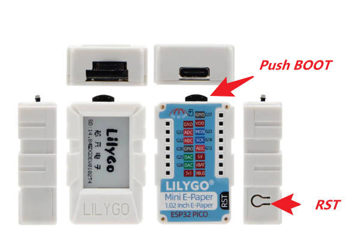

<h1 align = "center">LilyGO-Mini-E-Paper-S3</h1>

## **[中文](./README_CN.md) | English**

## :one: Description 🎁
This is the `LilyGO-Mini-E-Paper-S3` and `Lora extension` built on the hardware platform, for the `Meshtastic` software platform, you can use `PlatformIO IDE` to compile it. How to use the `Meshtastic` software platform, please refer to [official documentation](https://meshtastic.org/)。

## :two: Product 🎯

| Product(PinMap)              | SOC         | Flash | PSRAM     | Resolution | Size      | Driver       |
| ---------------------------- | ----------- | ----- | --------- | ---------- | --------- | ------------ |
| [Mini-E-Paper-S3][1]         | ESP32-FN4R2 | 4MB   | 2MB(QSPI) | 128x80     | 1.02 Inch | GDGDEW0102T4 |

[1]: https://www.lilygo.cc

## :three: Lora extension🎯
The extended version of Lora includes an `SX1262` Lora module, a `PCF85063` RTC module, and an infrared transmitter `MMBT3904`.

## :four: Preview
--------------------------------------

## :five: PlatformIO Quick Start

1. Install [Visual Studio Code](https://code.visualstudio.com/) and [Python](https://www.python.org/), and clone or download the project;
2. Search for the `PlatformIO` plugin in the `VisualStudioCode` extension and install it;
3. After the installation is complete, you need to restart `VisualStudioCode`
4. Then open the `Meshtastic` folder with VScode, PlatformIO will automatically download the required tripartite libraries and dependencies, the first time this process is relatively long, please wait patiently;
</img>
</img>
5. When all the dependencies are installed, you can open the `platformio.ini` configuration file and uncomment `default_envs = mini_e-paper` and comment the other `default_envs = xxx`. Select and press ctrl+s to save the.ini configuration file;
6. Click :ballot_box_with_check: under VScode to compile the project, then plug in USB and select COM under VScode;
7. Finally, click the :arrow_right:  button to download the program to Flash;

## :six: Pin overview
|   BUTTON      | ESP32S3 |
|:-------------:| :----------: |
|   BOOT_BUTTON         |  IO0    |  
|   NEXT_PAGE_BUTTON    |  IO3    |

|   LoRA SX1262  | ESP32S3 |
|:-------------:| :----------: |
|   LORA_DIO1    |  IO5        |  
|   LORA_MISO    |  IO6        |
|   LORA_CS      |  IO7        |
|   LORA_SCK     |  IO8        |
|   LORA_MOSI    |  IO17       |

|  GDGDEW0102T4 |  ESP32S3 |
|:-------------:| :----------: |
|PIN_EINK_MOSI  |    IO15      |
|PIN_EINK_SCLK  |    IO14      |
|PIN_EINK_CS    |    IO13      |
|PIN_EINK_DC    |    IO12      |
|PIN_EINK_RES   |    IO11      |
|PIN_EINK_BUSY  |    IO10      |

| PCF8563 RTC Module | ESP32S3  |
| :------------------: |:----------:|
| I2C_SDA            | IO18         |
| I2C_SCL            | IO9          |

|   MMBT3904       | ESP32S3  |
|:-------------:   | :----------: |
|  INFRARED_INPUT  |  IO21        | 

# Firmware burning
1. `Mini-E-Paper-S3` uses USB as the JTAG upload port. When printing serial port information on USB_CDC_ON_BOOT configuration needs to be turned on.
2. If the port cannot be found when uploading the program or the USB has been used for other functions, the port does not appear.
Please enter the upload mode manually.
   1. Connect the board via the USB cable
   2. Press and hold the BOOT button , While still pressing the BOOT button, press RST
      
   3. Release the RST
   4. Release the BOOT button
   5. Upload sketch
3. If the above is invalid, burn the [binary file](./firmware/README.MD)  to check whether the hardware is normal

4. Open the `tools` folder, unpack and install the `flash_download_tool_3.9.3` burning software, open `flash_download_Tool_3.9.exe` and burn `Mini-E-Paper-S3` as shown in the picture. Burn the corresponding files in this directory under the `firmware` folder.

# Meshtastic Firmware

## Overview

This repository contains the device firmware for the Meshtastic project.

- **[Building Instructions](https://meshtastic.org/docs/development/firmware/build)**
- **[Flashing Instructions](https://meshtastic.org/docs/getting-started/flashing-firmware/)**

## Stats

